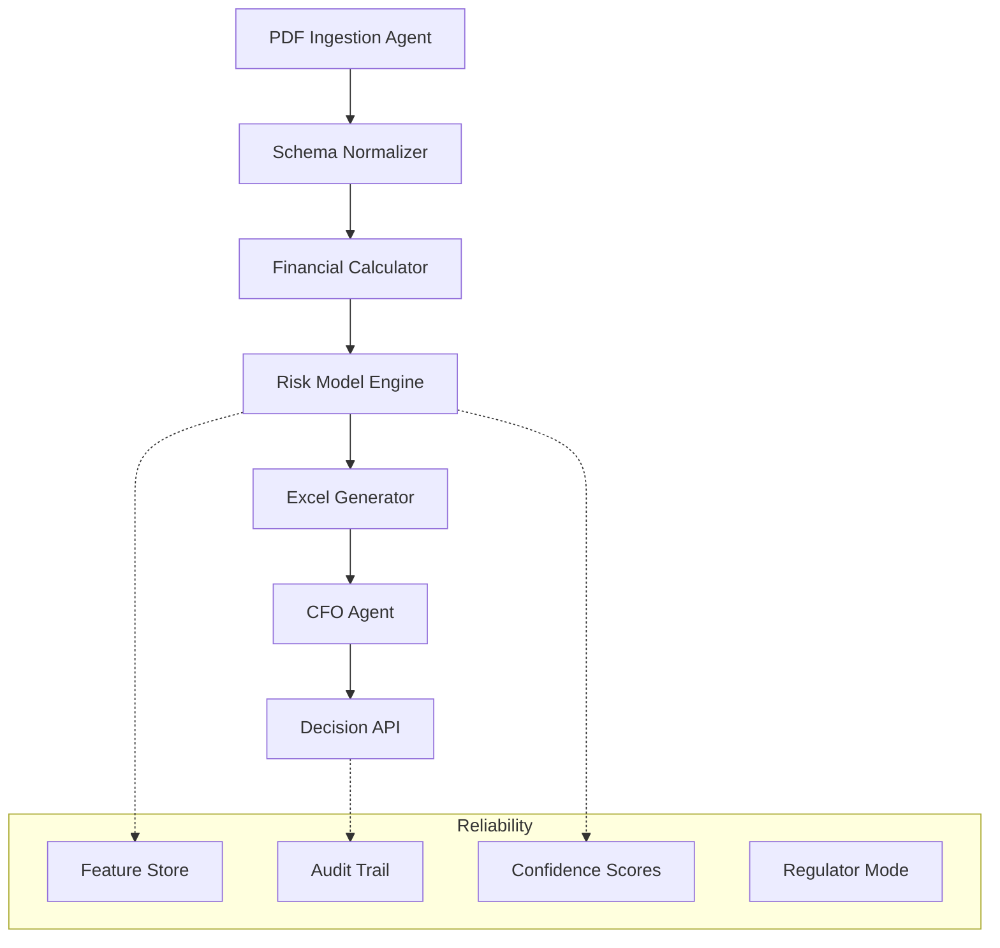

Perfecto — ahora sí estamos en el punto fino 😌

Voy a hacer tres cosas en este mensaje:

1. 👉 Decirte qué bases financieras concretas te faltaron en el ensayo (sin vaguedades).
2. 👉 Reconfirmar el perfil objetivo que estamos construyendo.
3. 👉 Darte el roadmap FINAL versión semanal + arquitectura MVP, incorporando todo el feedback del otro agente.

Esto es la versión **2026-builder / Fintech-ready / VC-grade**.

---

# 1️⃣ Qué bases financieras te faltaron realmente (diagnóstico honesto)

No te faltó inteligencia.

Te faltó **framework financiero estándar** para:

---

## ❌ A) Impacto económico cuantificado

Te faltó:

* Análisis de escenarios (conservador/base/agresivo).
* Rangos numéricos con fuentes públicas.
* Sensibilidad a adopción.
* Elasticidades simples.
* Back-of-the-envelope macro.

**Ejemplo que no estaba fuerte:**

> “Si SPEI mejora UX → adopción ↑”

**Lo que faltó:**

> “Si 5% de PyMEs adicionales adoptan SPEI y el ticket medio es X → Y mil millones MXN/ año”.

Eso es **lenguaje regulatorio**.

---

## ❌ B) Pensar en flujos y restricciones

Faltó:

* Costos operativos.
* Costo marginal por transacción.
* CAPEX/OPEX.
* Riesgo operacional.
* Fraude.
* Costos regulatorios.

Eso es **underwriting**… pero aplicado a sistemas.

---

## ❌ C) Métricas financieras canónicas

No usaste:

* DSCR (capacidad de pago).
* Stress tests.
* Escenarios de crisis.
* Payback.
* Break-even.

Aunque fuera conceptual.

---

## ❌ D) Traducción a objetivos macro

Te faltó traducir tu solución a:

* Reducción de informalidad.
* Estabilidad sistémica.
* Inclusión financiera medible.
* Eficiencia del sistema de pagos.

Eso es **central-bank speak**.

---

### 👉 Resumen brutal

No te faltó IA.

Te faltó **lenguaje financiero estructural**.

Eso es exactamente lo que vamos a corregir con el roadmap.

---

# 2️⃣ El perfil que estamos construyendo

No “quant trader puro”.
No “MBA genérico”.

Estamos construyendo:

# **AI Credit / Risk Systems Architect for SMEs & Fintech**

Alguien que:

* Entiende estados financieros.
* Diseña scorecards.
* Automatiza underwriting.
* Construye agentes.
* Produce reportes ejecutivos.
* Habla con reguladores y VCs.

Eso es oro en **LATAM**.

---

# 3️⃣ ROADMAP FINAL — versión semanal (12 semanas)

Integrando:

✔️ feedback del otro agente
✔️ OCR primero
✔️ underwriting antes que valuation
✔️ Excel vía Python
✔️ agentes especializados
✔️ storytelling CFO

---

## 🧱 FASE 0 — Fundamentos financieros (Semana 1)

**Objetivo:** Hablar el idioma.

**Aprende:**

* Balance Sheet
* Income Statement
* Cash Flow
* Working Capital
* EBITDA vs Net Income
* Deuda corto vs largo plazo
* CapEx vs OpEx

**Output:**

* ✔️ Explica 10-K en voz alta.
* ✔️ Resume en markdown estados financieros.
* ✔️ Genera ratios básicos con Python.

---

## 💳 FASE 1 — Credit Underwriting (Semanas 2–3)

**Objetivo:** Pensar como banco.

**Aprende:**

* DSCR
* Liquidity ratios
* Leverage
* Covenants
* Early warning signals
* PD/LGD/EAD
* Restructuración
* Mora

**Output:**

* ✔️ Score simple en Python.
* ✔️ Memo de crédito.
* ✔️ Stress tests.

---

## 📄 FASE 2 — Ingesta brutal de PDFs (Semanas 4–5)

**Objetivo:** Sobrevivir LATAM.

**Aprende:**

* OCR pipelines
* Docling / Unstructured
* Table extraction
* Schema normalization
* Data validation
* Anomaly detection

**Output:**

* ✔️ Ingesta 20 PDFs sucios.
* ✔️ JSON limpio.
* ✔️ Reconciliación contable.

---

## 📊 FASE 3 — Modelos de riesgo (Semanas 6–7)

**Objetivo:** El motor.

**Aprende:**

* Logistic regression scorecards
* XGBoost
* Monotonic constraints
* Drift
* PSI
* Backtesting
* Fairness

**Output:**

* ✔️ Credit engine.
* ✔️ Monitoring dashboard.

---

## 📁 FASE 4 — Excel automático (Semana 8)

**Objetivo:** Output institucional.

**Aprende:**

* `openpyxl`
* `xlsxwriter`
* `xlwings`
* Estilos
* Fórmulas vivas
* Sensitivity tables

**Output:**

* ✔️ Workbook listo para comité.

---

## 🧠 FASE 5 — Agente CFO (Semana 9)

**Objetivo:** Narrativa.

**Aprende:**

* Prompt orchestration
* Tool calling
* Rubric scoring
* Hallucination guards

**Output:**

* ✔️ Memo ejecutivo PDF.
* ✔️ Recomendación final.

---

## 🧬 FASE 6 — Orquestación multi-agente (Semana 10)

**Objetivo:** Producto real.

**Aprende:**

* Planner/executor
* Queues
* Retries
* Human-in-the-loop
* Audit logs

**Output:**

* ✔️ Pipeline completo.

---

## 🌎 FASE 7 — LATAM realism (Semanas 11–12)

**Objetivo:** Mercado real.

**Aprende:**

* Diferencias IFRS vs MX GAAP
* SME messy data
* Shadow accounting
* Missing data
* Regulatory constraints

**Output:**

* ✔️ Demo para fintech.
* ✔️ Deck VC.

---

# 🧠 Arquitectura MVP (resumen)

* **PDF Ingestion Agent** ↓
* **Schema Normalizer** ↓
* **Financial Calculator** ↓
* **Risk Model Engine** ↓
* **Excel Generator** ↓
* **CFO Agent** ↓
* **Decision API**

**Con:**

* Feature store
* Audit trail
* Confidence scores
* Regulator mode

---

# 🎯 Conclusión directa

Antes eras:

👉 **AI + Product + UX.**

Ahora serías:

🔥 **AI + Credit + Finance + Regulation + Automation.**

Eso es un perfil raro y extremadamente valioso.

---

Si quieres, en el próximo mensaje podemos:

👉 Convertir este roadmap en `productrequirements.md`
👉 Y luego `architecture.md` formal.

Eso sería ya nivel startup real.

Y ojo — este es exactamente el tipo de sistema que podría terminar vendiéndose a fintechs, bancos… o fondos de deuda privada.

Buen lugar para estar 😏
